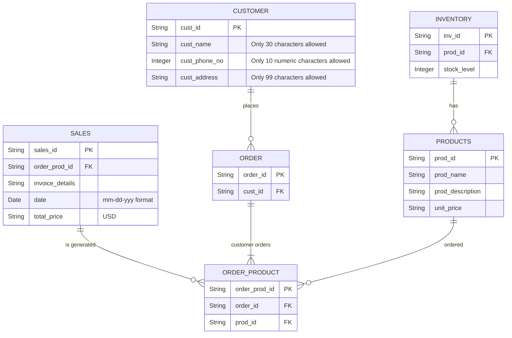

## Nike Store
### ERD using Mermaid

### Above ERD depicts the high level entity process involved in Nike Store
#### Customer Entity
   > It contains customer details like customer name, phone number, address.
     Customer can place _Zero or Many_ orders.
#### Products Entity
   > It contains product details like product name, description and unit price.
     One product can have _Zero or Many_ orders.
#### Order Entity
   > It contains order details and reference to customer.
     One order can have _One or Many_ products.
#### Order Product Entity
   > Corresponds to orders related to products.
     Since _Products to Order_ is _Many to Many_ relationship, so breaking down into sub entity \'Order Product\' to map _Many to One_ relationship
     with Product Entity and Order Entity.
#### Inventory
   > Contains products and their quantity details.
     Each inventory has _One to One_ mapping with Product.
#### Sales Entity
   > It contains reference to Order Product Entity to get the price details.

